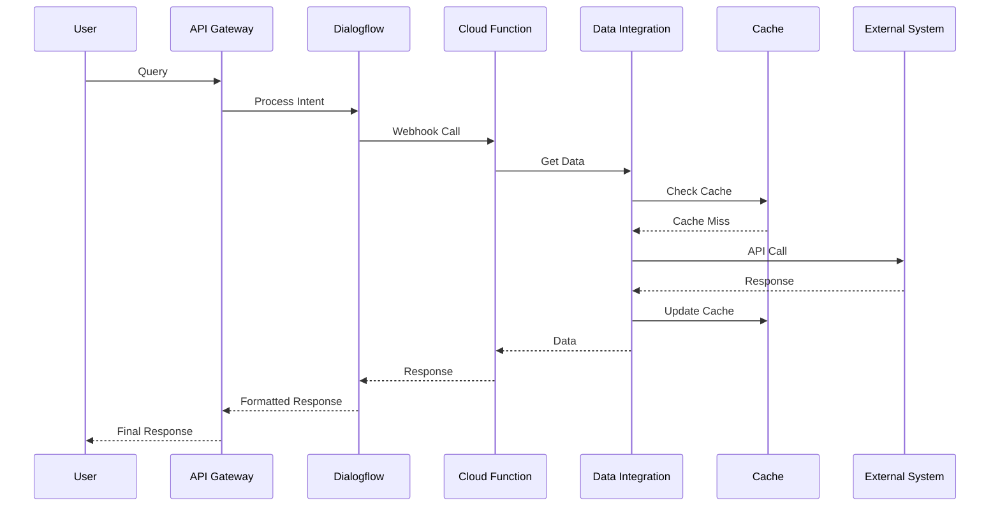

# Technical Specifications - Forest Service Chatbot

## 1. API Gateway Configuration (Cloud Endpoints)

### 1.1 Gateway Architecture
```yaml
service_name: chatbot.fs.usda.gov
type: google.api.Service
config_version: 3

endpoints:
  - name: chatbot.fs.usda.gov
    target: ${ENDPOINT_IP}
    allowCors: true
```

### 1.2 API Configuration
```yaml
apis:
  - name: fs.chatbot.v1.ChatbotService
    methods:
      - name: Query
        requestType: QueryRequest
        responseType: QueryResponse
    version: v1
```

### 1.3 Rate Limiting
```yaml
quota:
  limits:
    - name: RequestsPerMinute
      metric: fs.chatbot.v1/requests
      unit: 1/min
      values:
        STANDARD: 1000
```

## 2. DialogFlow CX Setup

### 2.1 Agent Configuration
```json
{
  "displayName": "Forest Service Chatbot",
  "defaultLanguageCode": "en",
  "timeZone": "America/New_York",
  "enableStackdriverLogging": true,
  "enableSpellCorrection": true,
  "speechToTextSettings": {
    "enableSpeechAdaptation": true
  }
}
```

### 2.2 Intent Structure
```yaml
intents:
  - TrailStatus:
      trainingPhrases:
        - "What's the status of {trail_name}"
        - "Is {trail_name} open"
      parameters:
        - trail_name:
            entityType: @sys.any
            required: true
      
  - PermitInquiry:
      trainingPhrases:
        - "How do I get a permit for {activity}"
        - "Permit requirements for {activity}"
      parameters:
        - activity:
            entityType: @activity
            required: true
```

### 2.3 Webhook Configuration
```yaml
webhook:
  url: ${CLOUD_FUNCTION_URL}
  timeout: 5s
  failurePolicy:
    retry:
      maxRetries: 3
```

## 3. Data Flow Architecture

### 3.1 Message Flow


### 3.2 Data Processing Pipeline
```yaml
stages:
  - input_validation:
      type: synchronous
      timeout: 1s
  - intent_processing:
      type: synchronous
      timeout: 2s
  - data_retrieval:
      type: asynchronous
      timeout: 5s
      retry:
        maxAttempts: 3
  - response_formatting:
      type: synchronous
      timeout: 1s
```

## 4. Caching Strategy

### 4.1 Cache Configuration (Redis)
```yaml
redis:
  version: 6.x
  tier: basic
  memory_size_gb: 5
  region: us-central1
  read_replicas: 1
  high_availability: true
```

### 4.2 Cache Policies
```json
{
  "defaultTTL": 3600,
  "policies": {
    "trail_status": {
      "ttl": 300,
      "updateType": "background"
    },
    "weather_data": {
      "ttl": 1800,
      "updateType": "lazy"
    },
    "permit_info": {
      "ttl": 7200,
      "updateType": "background"
    }
  }
}
```

## 5. Performance Requirements

### 5.1 Latency Targets
```yaml
latency:
  p50: 500ms
  p90: 1000ms
  p99: 2000ms
```

### 5.2 Throughput
```yaml
throughput:
  steady_state_qps: 1000
  peak_qps: 2000
  concurrent_users: 500
```

## 6. Scalability Configuration

### 6.1 GKE Cluster
```yaml
gke:
  node_pools:
    - name: default-pool
      machine_type: e2-standard-2
      initial_node_count: 3
      autoscaling:
        min_node_count: 3
        max_node_count: 10
      auto_upgrade: true
```

### 6.2 Cloud Functions
```yaml
functions:
  memory: 256MB
  timeout: 60s
  min_instances: 2
  max_instances: 10
  concurrency: 80
```

## 7. Monitoring and Logging

### 7.1 Metrics Configuration
```yaml
metrics:
  - name: request_latency
    type: DELTA
    metric_kind: GAUGE
    value_type: DOUBLE
    unit: ms
  - name: error_rate
    type: CUMULATIVE
    metric_kind: GAUGE
    value_type: DOUBLE
    unit: percent
```

### 7.2 Log Sinks
```yaml
logging:
  sinks:
    - name: error_logs
      destination: bigquery.googleapis.com/projects/${PROJECT_ID}/datasets/chatbot_logs
      filter: severity >= ERROR
    - name: audit_logs
      destination: storage.googleapis.com/${BUCKET_NAME}/audit_logs
      filter: resource.type="cloud_function"
```

## 8. Disaster Recovery

### 8.1 Backup Configuration
```yaml
backup:
  schedule: "0 */6 * * *"  # Every 6 hours
  retention_days: 30
  locations:
    - us-central1
    - us-east1
```

### 8.2 Recovery Procedures
```yaml
recovery:
  rto: "4h"  # Recovery Time Objective
  rpo: "1h"  # Recovery Point Objective
  steps:
    - validate_backup_integrity
    - restore_configuration
    - verify_data_consistency
    - switch_traffic
```

## Version History
| Version | Date | Author | Changes |
|---------|------|---------|---------|
| 1.0 | 2025-02-01 | Solutions Architecture Team | Initial Release |